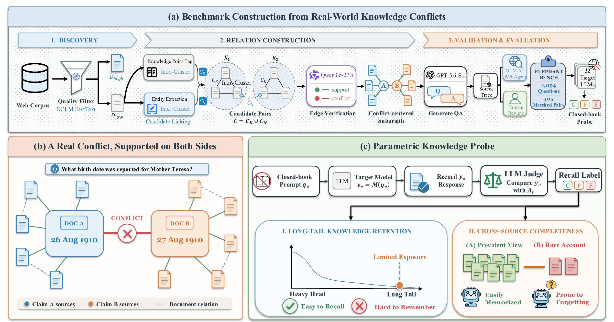

# ElephantBench

<p align="center">
  <a href="https://github.com/Tencent/ElephantBench">
    
  </a>
  <a href="https://tencent.github.io/ElephantBench/">
    
  </a>
  <a href="https://arxiv.org/abs/2608.28478">
    
  </a>
</p>

ElephantBench is a closed-book knowledge probe for evaluating whether a language model remembers long-tail facts and whether it recalls the different verified accounts associated with those facts. The benchmark contains 1,094 questions using two formulation types: a named-entity form and a clue-based form.

The dataset is also available on [Hugging Face](https://huggingface.co/datasets/Tencent/ElephantBench).



The package provides six commands:

- `elephantbench-run`: query an OpenAI-compatible model without sources or tools;
- `elephantbench-judge`: assign complete, partial, or failed recall using an LLM judge;
- `elephantbench-score`: compute the fixed-denominator C/P/F/K metrics;
- `elephantbench-analyze`: report per-model metrics and greedy cross-model oracle coverage;
- `elephantbench-validate`: validate dataset structure and IDs;
- `elephantbench-construct`: tag raw documents, retrieve and classify document pairs, build
  conflict subgraphs, synthesize paired questions, verify them, and export benchmark records.

## Installation

Python 3.10 or newer is required. Run the following commands from this directory. The core package has no third-party runtime dependencies.

```bash
python -m venv .venv
source .venv/bin/activate
python -m pip install -e .
```

Reconstructing the benchmark additionally requires the construction dependencies:

```bash
python -m pip install -e '.[construction]'
```

## Run a model

The runner uses the standard non-streaming OpenAI-compatible `/chat/completions` interface. Only the system instruction and the benchmark question are sent to the target model. Gold answers, source documents, retrieval tools, and browsing tools are never included in the request.

```bash
export OPENAI_API_KEY="..."
export OPENAI_BASE_URL="https://api.openai.com/v1"

elephantbench-run \
  --input data/elephantbench.jsonl \
  --output outputs/my-model.jsonl \
  --model my-model \
  --workers 4 \
  --temperature 0 \
  --max-tokens 8192 \
  --resume
```

Use `--header NAME=VALUE` for gateways that require an additional non-secret routing header. Do not put API keys or authentication captures inside this repository.

## Judge and score responses

Judge saved responses with any OpenAI-compatible model:

```bash
elephantbench-judge \
  --benchmark data/elephantbench.jsonl \
  --responses outputs/my-model.jsonl \
  --output outputs/my-model.judged.jsonl \
  --judge-model my-judge-model \
  --workers 4 \
  --resume
```

Then compute the paper metrics:

```bash
elephantbench-score \
  --benchmark data/elephantbench.jsonl \
  --results outputs/my-model.judged.jsonl \
  --output outputs/my-model.summary.json
```

The three outcome rates are mutually exclusive and exhaustive:

- **C (complete recall):** every verified answer is covered without a material contradiction;
- **P (partial recall):** at least one, but not every, verified answer is covered;
- **F (failed recall):** no verified answer is covered, the answer materially contradicts the references, or generation/judging failed.

They satisfy `C + P + F = 1`. Conditional completeness is `K = C / (C + P)` and measures complete recall among questions for which the model recalls at least one verified answer. Missing result rows and request failures remain in the fixed benchmark denominator and count toward F.

For subgroup and model-complementarity analysis, pass one or more labeled result files:

```bash
elephantbench-analyze \
  --benchmark data/elephantbench.jsonl \
  --result model_a=outputs/model-a.judged.jsonl \
  --result model_b=outputs/model-b.judged.jsonl \
  --output outputs/analysis.json
```

This reports per-model C/P/F/K, followed by a greedy oracle curve that adds the model contributing the largest number of new complete answers.

## Benchmark Construction

The construction pipeline turns prefiltered $D_{\mathrm{low}}$ documents into verified, paired
benchmark questions:

```text
D_low documents
  -> full-document store + SuperGPQA++ tagging + T-NER extraction
  -> subject-slot preparation -> candidate retrieval -> relation classification
  -> conflict subgraphs -> paired QA synthesis -> full-document validation
  -> independent web verification -> export
```

Download the prefiltered $D_{\mathrm{low}}$ source corpus from the
[ElephantBench-Source repository](https://huggingface.co/datasets/panzs19/ElephantBench-Source)
and initialize the construction workspace:

```bash
export DATA_SOURCE=data/ElephantBench-Source
export CONSTRUCTION_OUT=outputs/construction

hf download panzs19/ElephantBench-Source \
  --repo-type dataset \
  --local-dir "$DATA_SOURCE"

elephantbench-construct \
  --results-dir "$CONSTRUCTION_OUT" \
  build-store \
  --input "$DATA_SOURCE"
```

Configure an OpenAI-compatible endpoint for the model-assisted stages:

```bash
export OPENAI_BASE_URL=https://example.test/v1
export OPENAI_API_KEY="..."
export OPENAI_MODEL=model-id
```

### 1. Tag knowledge points

Assign a SuperGPQA++ knowledge-point label to each document:

```bash
elephantbench-construct \
  --results-dir "$CONSTRUCTION_OUT" \
  tag-kp \
  --input "$DATA_SOURCE" \
  --workers 20 \
  --timeout 1200
```

### 2. Extract entities

Run T-NER over the same documents:

```bash
elephantbench-construct \
  --results-dir "$CONSTRUCTION_OUT" \
  tag-ner \
  --input "$DATA_SOURCE" \
  --device cuda:0
```

Use `--devices cuda:0,cuda:1,...` to distribute shards over multiple GPUs, or use
`--device cpu` when CUDA is unavailable. Full-corpus CPU extraction will be much slower.

### 3. Prepare document anchors

Join the two tag streams into `(knowledge point, subject, slot)` anchors:

```bash
elephantbench-construct \
  --results-dir "$CONSTRUCTION_OUT" \
  --workers 8 \
  prepare
```

### 4. Retrieve candidate pairs

Generate bounded candidates within `(knowledge point, subject, slot)` groups and across
different knowledge points that share a normalized T-NER entity. Frequency filters and
per-document Top-K retrieval keep large entity groups tractable.

```bash
elephantbench-construct \
  --results-dir "$CONSTRUCTION_OUT" \
  --workers 8 \
  candidates
```

### 5. Classify document relations

Read both full documents and classify each pair as `support`, `conflict`, or `none`:

```bash
elephantbench-construct \
  --results-dir "$CONSTRUCTION_OUT" \
  classify \
  --processes 20 \
  --threads-per-process 20 \
  --timeout 1200
```

### 6. Build conflict subgraphs

Attach supporting neighbors to both endpoints of each conflict edge:

```bash
elephantbench-construct \
  --results-dir "$CONSTRUCTION_OUT" \
  subgraphs
```

### 7. Synthesize paired questions

Generate one named-entity question and one clue-based question for each retained
conflict group:

```bash
elephantbench-construct \
  --results-dir "$CONSTRUCTION_OUT" \
  synthesize \
  --workers 8
```

### 8. Validate the source documents

Use an independent LLM pass to read every full document in the retained subgraph and
confirm that each synthesized answer is explicitly reported:

```bash
elephantbench-construct \
  --results-dir "$CONSTRUCTION_OUT" \
  validate-sources \
  --workers 8
```

### 9. Verify answers on the public web

After source validation, use Brave Search and the built-in web fetcher to obtain
independent evidence for every proposed answer. Set
`OPENAI_VERIFY_MODEL=model-id` only if the endpoint requires explicit model selection.

```bash
export BRAVE_SEARCH_API_KEY="..."

elephantbench-construct \
  --results-dir "$CONSTRUCTION_OUT" \
  verify \
  --workers 4
```

### 10. Export benchmark records

Export two questions for every verified conflict group:

```bash
elephantbench-construct \
  --results-dir "$CONSTRUCTION_OUT" \
  export
```

### 11. Human review

Every exported conflict group must be reviewed before release. Reviewers confirm that
both questions refer to the intended fact, each answer is independently supported by
the retained sources and external evidence, the reported accounts are genuinely
incompatible, and the questions contain no answer leakage or material ambiguity. Only
groups that pass this review are included in the benchmark.

All intermediate files are written to `CONSTRUCTION_OUT`. Remote stages resume from
completed records by default. Run `elephantbench-construct <command> --help` for
concurrency, retry, filtering, and audit options.

## License

ElephantBench is released under the [Apache License 2.0](LICENSE).

## Citation

```
@article{pan2026elephantbench,
  title={Blind Men and the Elephant: Probing the Epistemic Myopia of LLMs under Long-Tail Divergent Knowledge},
  author={Pan, Zhuoshi and Lu, Junru and Qian, Yan and Zhao, H. Vicky and Yin, Di and Sun, Xing},
  journal={arXiv preprint arXiv:2608.28478},
  year={2026}
}
```
